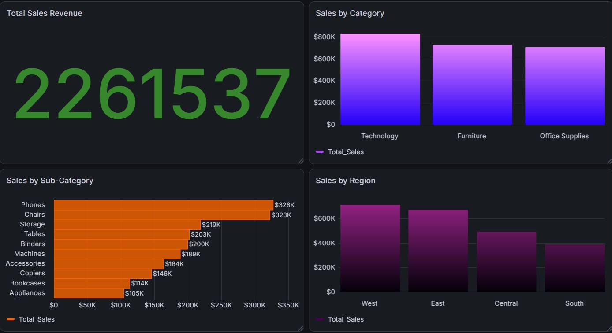
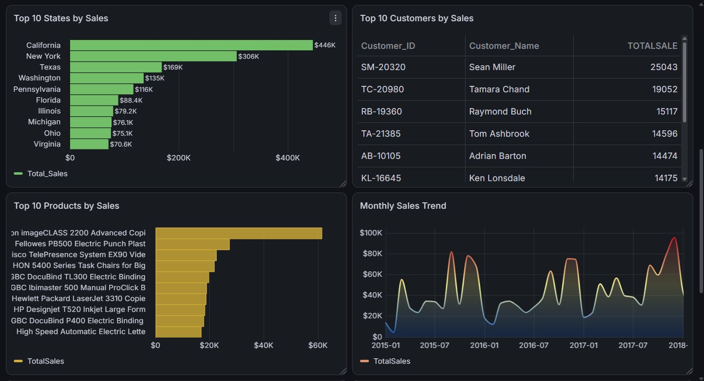
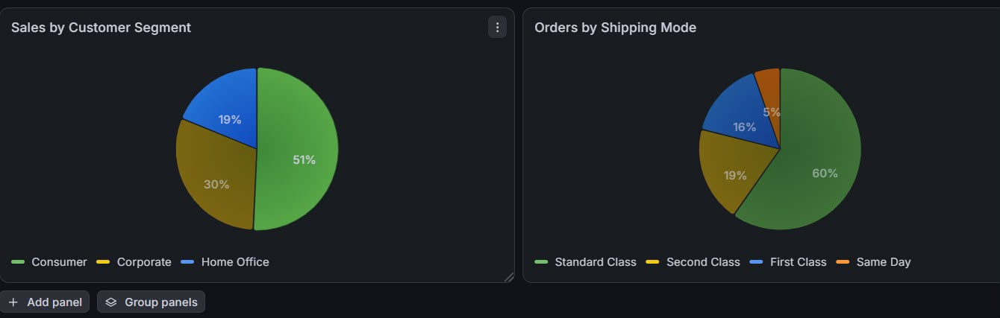

# 📊 Superstore Sales Dashboard

A sales analytics dashboard built using **Microsoft SQL Server** and **Grafana** to analyze sales performance, customer behavior, product trends, and regional performance.

---

## 📌 Project Overview

This project demonstrates how SQL can be used to answer business questions and how Grafana can visualize those insights through an interactive dashboard.

The dashboard focuses on:

- Total Sales Revenue
- Sales by Category
- Sales by Sub-Category
- Sales by Region
- Top States by Sales
- Top Customers
- Top Products
- Monthly Sales Trend
- Customer Segments
- Shipping Modes

---

## 🛠️ Tools Used

- Microsoft SQL Server
- SQL Server Management Studio (SSMS)
- Grafana
- SQL

---

## 📂 Dataset

Dataset: Superstore Sales Dataset

The dataset contains information about:

- Orders
- Customers
- Products
- Sales
- Profit
- Regions
- Shipping Details

---

# 📸 Dashboard

## Overview



---

## Sales Analysis



---

## Customer Segments & Shipping



---

# 📈 Business Questions Answered

- What is the total sales revenue?
- Which category generates the highest sales?
- Which sub-category generates the highest sales?
- Which region performs the best?
- Which states generate the highest sales?
- Who are the top customers?
- Which products generate the most revenue?
- How do sales change over time?
- Which customer segment contributes the most sales?
- Which shipping mode is used the most?

---

# ✅ Data Quality Checks

Before analysis, the dataset was validated by checking:

- Total records
- Missing postal codes
- Duplicate Row IDs
- Blank customer names
- Blank product names
- Invalid shipping dates
- Negative sales values

---

# 📁 Repository Structure

```
Superstore-Sales-Dashboard/
│
├── Dashboard_Overview.jpeg
├── Dashboard_Analysis.jpeg
├── Dashboard_Segments.jpeg
├── Superstore_SQL_Queries.sql
└── README.md
```

---

# 🚀 Skills Demonstrated

- SQL Queries
- Data Validation
- Business Analysis
- Dashboard Development
- Data Visualization
- KPI Reporting
- Sales Analytics

---

## 👨‍💻 Author

**Adnan Aslam**

Business Data Analytics Student

COMSATS University Islamabad, Lahore Campus
